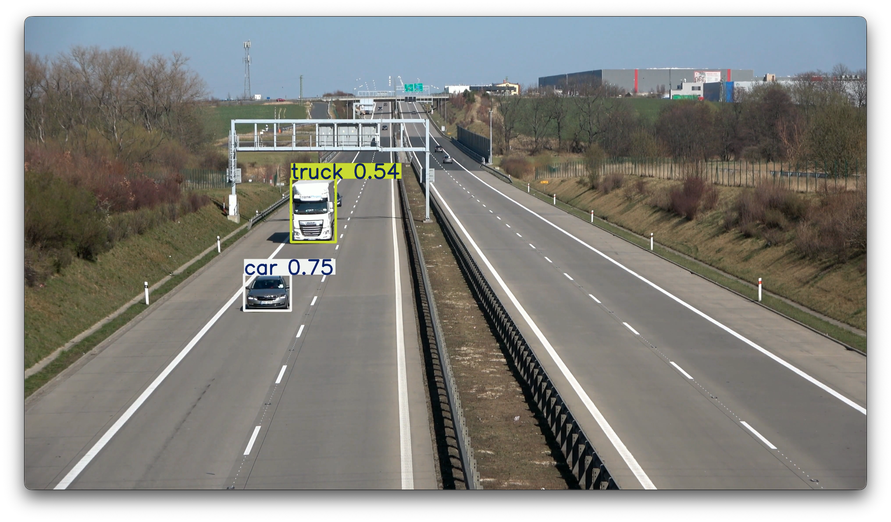
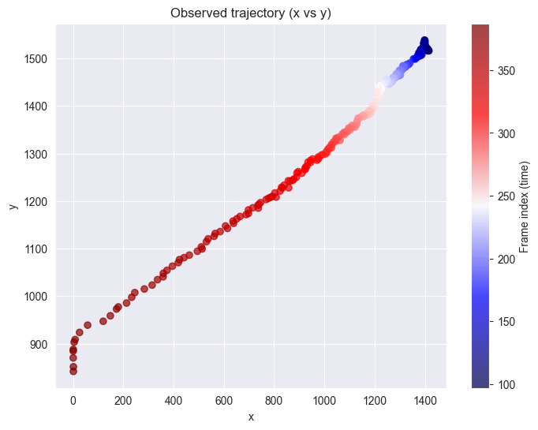

# 2025 25 Robotic Perception and Human-Robot Interaction 1

## Assignment 2: Development

- Student ID: M223351
- Name: Yuya HAGA

## Problem Definition

I decided to work on an object tracking task for this assignment.

Recently, deep learning-based object tracking methods have been widely used due to their high accuracy and robustness. However, these methods often require significant computational resources and large amounts of training data.

On the other hand, widely used object detection models, such as YOLO (You Only Look Once), have been developed to perform real-time object detection with high accuracy and low-computational resource.

However, object detection models do not provide information about the temporal continuity of objects across frames in a video.
Therefore, to track objects over time, it is necessary to combine object detection with an object tracking algorithm.

## An overview of an algorithm

### Dataset

I obtained a highway video dataset from the following link:
[https://media.roboflow.com/supervision/video-examples/vehicles.mp4](https://media.roboflow.com/supervision/video-examples/vehicles.mp4)

### Object Detection

YOLOv11 was used for object detection.

The YOLO series model is a well-known object detection model that can perform real-time detection with high accuracy. The model was pre-trained on the COCO dataset, which includes various object classes, including trucks.

The version used in this assignment ise YOLOv11n, which is the most lightweight model in the YOLOv11 series. This model is suitable for real-time applications and resource-constrained environments.

The selected class for tracking in this assignment was "truck".

### Object Tracking

Kalman Filter was implemented for object tracking.
The observation data for the Kalman Filter was obtained from the output of the YOLOv11n model.

## Development Environment

- OS: macOS Tahoe
- Programming Language: Python 3.12
  - Libraries:
    - ultralytics : for YOLOv11
    - OpenCV : for video processing
    - pandas : for data manipulation
    - matplotlib : for data visualization
    - NumPy: for kalman filter implementation

## Results

### Object Detection by YOLOv11n

The following image shows the detection results of trucks in a video frame using YOLOv11n.
The bounding box indicates the detected truck in the frame.

The trajectory of the detected truck over time (i.e., observations for the Kalman Filter) is shown in the following plot.

### Object Tracking by Kalman Filter

The following plot shows the trajectory of the truck estimated by the Kalman Filter.
The blue dots represent the observations from the YOLOv11n model, the red line represents the trajectory smoothed by Kalman filter, and the orange line represents the trajectory estimated by the Kalman Filter.

A figure below shows the tracking results of the Kalman Filter on a video frame. A red dot indicates the observation from the YOLOv11n model, and a green dot indicates the position estimated by the Kalman Filter.

## Discussion

As shown in the results, the obtained tracking trajectory by the Kalman Filter is smoother than the observation trajectory from the YOLOv11n model. This indicates that the Kalman Filter effectively reduces noise and fluctuations in the observations, resulting in a more stable and accurate tracking of the truck's position over time.

However, this project has some limitations:

1. Multiple Object Tracking: The current implementation only tracks a single truck in the video. In real-world scenarios, there may be multiple trucks or other vehicles present. Extending the Kalman Filter to handle multiple objects would be necessary for practical applications.
2. Occlusions and Missed Detections: In some frames, the YOLOv11n model may fail to detect the truck due to occlusions or other factors. In this project, such cases were completed by linear interpolation before applying the Kalman filter. However, more sophisticated methods for handling occlusions and missed detections could improve tracking performance.
3. Postprocessing of Detection Results: The output of the YOLOv11n model is bounding boxes. In this project, the corner point of the bounding box was used as the observation for the Kalman Filter. However, such a point may not accurately represent the position of the truck. Developing a method to extract more representative points from the bounding boxes could enhance tracking accuracy.
